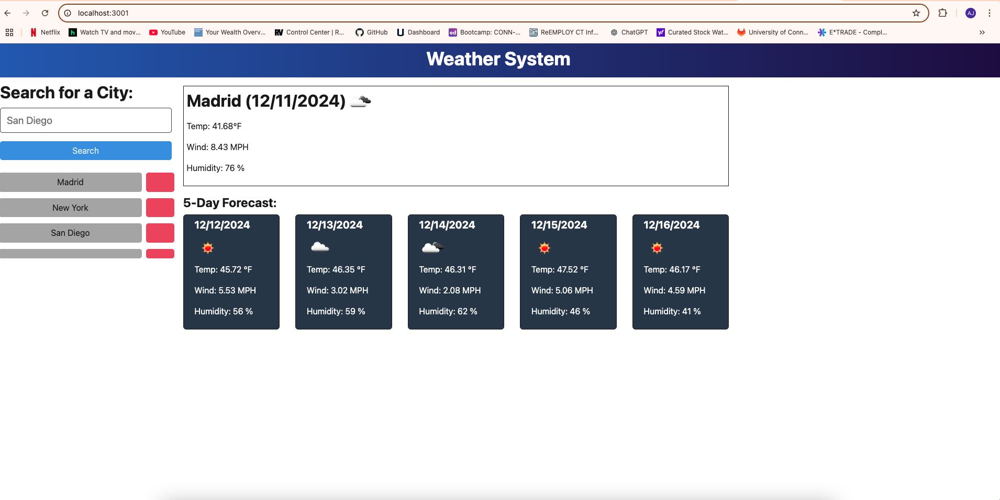

# 🌦️ Weather Forecast System
A full-stack weather dashboard that allows users to search for a city and view the current weather and a 5-day forecast. The project includes a frontend built with Vite and TypeScript and a backend built with Express and Node.js. The app integrates with the OpenWeather API to fetch weather data.

# 🚀 Table of Contents
Project Description
Features
Technologies Used
Folder Structure
Setup Instructions
Environment Variables
API Endpoints
Deployment
Screenshots
Future Improvements
License

# 📖 Project Description
The Weather Dashboard allows travelers to search for weather forecasts of multiple cities. The application displays current weather conditions and a 5-day forecast, helping users plan their trips accordingly. The backend uses Express to handle API requests and stores search history, while the frontend provides an intuitive user interface.

# 🌟 Features
1. City Search: Search for any city to get weather data.
2. Current Weather: View current weather conditions, including:
3. Temperature
4. Humidity
5. Wind Speed
6. Weather Icon and Description
7. 5-Day Forecast: Displays weather for the next 5 days.
8. Search History: Stores and displays previously searched cities.
9. Delete History: Delete specific cities from search history.
10. Error Handling: Alerts for invalid API keys or city names.

# 🛠️ Technologies Used
1. Frontend (Client)
2. Vite (Build Tool)
3. TypeScript
4. HTML/CSS/JavaScript
5. Backend (Server)
6. Node.js
7. Express
8. TypeScript
10. dotenv (for managing environment variables)
11. APIs
12. OpenWeather API (for weather data)

# 🔧 Available Scripts
1. Root Scripts:
npm install = Install all dependencies in the root folder.
npm run build = Build the client and server.
npm run start = Build and start the server in production mode.
npm run start:dev = Start the server and client in development mode.

2. Client Scripts:
npm run dev = Start the Vite development server.
npm run build = Build the client for production.
npm run preview = Preview the production build.

3. Server Scripts:
npm run build = Compile TypeScript to JavaScript.
npm run dev = Start the server with nodemon.
npm start = Start the server in production mode.

# 🌐 API Endpoints
1. Get Weather Data
Endpoint: POST /api/weather
Description: Fetch weather data for a city and save it to the search history.

Request Body:

json
Copy code
{
  "cityName": "London"
}
Response:

json
Copy code
{
  "weather": { ... },
  "savedCity": { "id": "uuid", "cityName": "London" }
}

2. Get Search History
Endpoint: GET /api/weather/history
Description: Retrieve the search history.

Response:

json
Copy code
[
  { "id": "uuid", "cityName": "London" },
  { "id": "uuid", "cityName": "New York" }
]

3. Delete City from History
Endpoint: DELETE /api/weather/history/:id
Description: Delete a city from the search history by its ID.

# 🚀 Deployment
Deploy to Render
Push to GitHub:

bash
Copy code
git add .
git commit -m "Initial commit"
git push origin main
Deploy to Render:

Go to Render.
Connect your repository.
Set environment variables (API_KEY).
Deploy both the server and client.

# 🖼️ Screenshots

# 📜 License
This project is licensed under the MIT License.

# Thank You! 🌟
If you have any questions or need further assistance, feel free to open an issue or reach out!

# Website Link
1. http://localhost:3001/